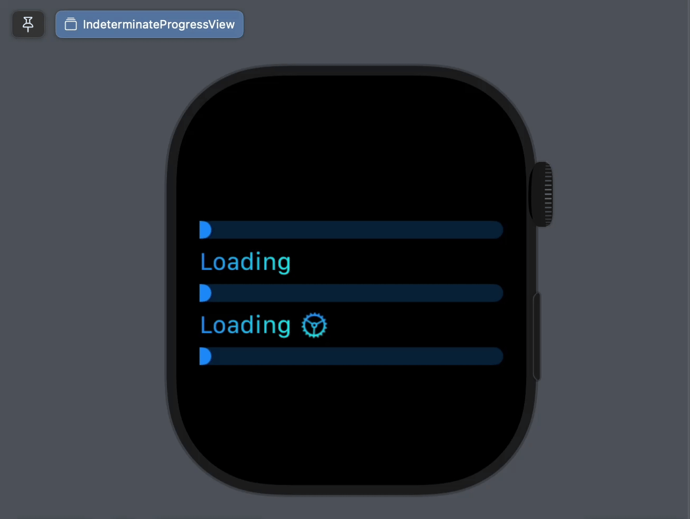

# IndeterminateProgressView

`IndeterminateProgressView` is a SwiftUI package designed to replicate the macOS `ProgressView` with the linear indeterminate style across all platforms, including iOS, iPadOS, watchOS, and visionOS.



## Features  
- MacOS-inspired **linear indeterminate progress view**.  
- Cross-platform compatibility: **iOS, iPadOS, watchOS, visionOS**.  
- Lightweight and easy to integrate.

## Installation  

### Swift Package Manager (SPM)  
1. In Xcode, go to `File > Add Packages...`.  
2. Enter the repository URL https://github.com/tphduy/IndeterminateProgressView
3. Select the package and add it to your project.  

## Usage  

To use `IndeterminateProgressView` in your SwiftUI views:  

```swift
import IndeterminateProgressView

struct ContentView: View {
    var body: some View {
        VStack {
            // Without title.
            IndeterminateProgressView()

            // A localized title.
            IndeterminateProgressView("Loading")
            
            // Title customization.
            IndeterminateProgressView {
                HStack {
                    Text("Loading")
                    Image(systemName: "gear")
                }
            }
        }
        .tint(.mint) // To customize the indicator color.
        .foregroundStyle(.cyan) // To customize the title and progress bar color.
    }
}
```

## Compatibility  
- **Platforms**: iOS 15+, macOS 12+, tvOS 15.0+, visionOS 1.0+, watchOS 7+.  
- **Swift Version**: Swift 5.5 or higher.  

## License  
`IndeterminateProgressView` is released under the [MIT License](LICENSE.txt).